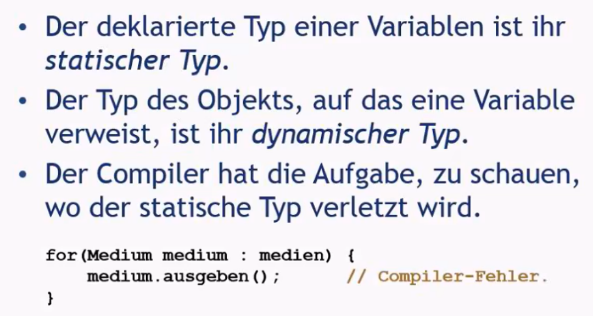
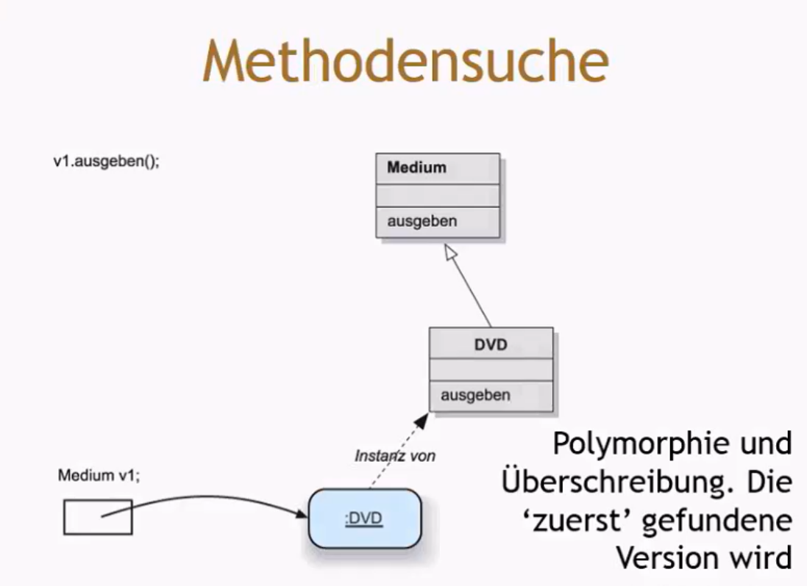
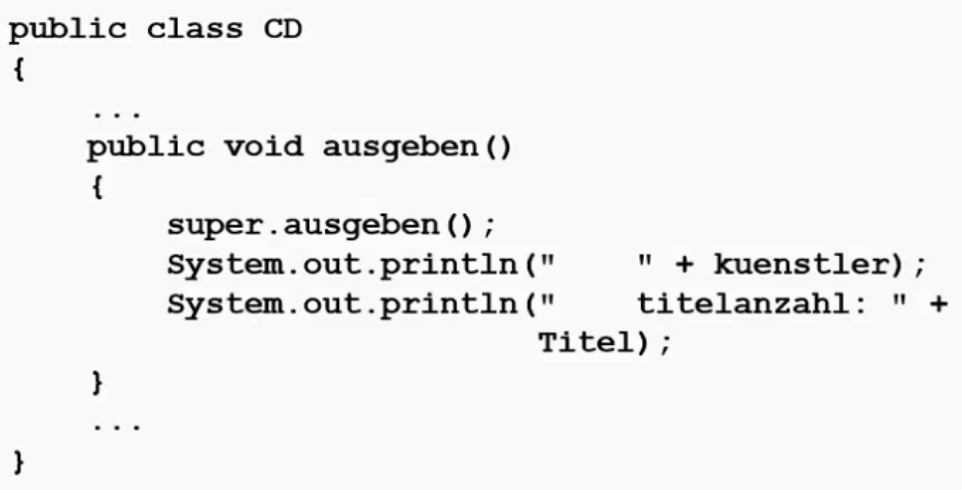

# Modul 2
## Video 1
Bei den Klassen, im Video DVD und CD benötigt man immer "anzeigen" als Methode 

In der Datenbank Klasse werden die DVDs und CDs welche auch Subklassen genannt werden, mit Arraylists mitgegeben. Das ermöglicht, dass die Klasse Datenbank alle Lists ausfüllen und ausgeben kann.

Durch die Klasse Medium auch Superklasse genannt, werden Dublikate von Methoden verhindert.

Durch die Verbindung der Subklassen mit der Superklasse benötigt es in der Datenbankklasse nur noch einen Quellcode welcher für alle Subklassen funktioniert.

#### Wichtig: 
Objekte von Subklassen können verwendet werden, wo Objekte eines Supertyps erwartet werden. *= Ersetzbarkeitsprinzip*

### Subtyping

#### Subklassen und Subtyping

- Klassen definieren Typen.
- Subklassen definieren Subtypen.
- Objekte von Subklassen können dort verwendet werden, wo Objekte eines Supertyps erwartet werden (auch bekannt als Ersetzbarkeit).
- Objekte von Subklassen können Variablen der Superklassen zugewiesen werden.
- Ebenso können Objekte von Subklassen als Parameter in Methoden der Superklassen übergeben werden.

### Polymorphe Variablen

- In Java sind Objektvariablen polymorph, was bedeutet, dass sie Objekte von mehr als einem Typ speichern können.
- Sie können Objekte des deklarierten Typs oder von Subtypen des deklarierten Typs halten.

### Casting

- Subtypen können problemlos einem Supertyp zugewiesen werden.
- Der umgekehrte Fall, also das Zuweisen eines Supertyps an einen Subtyp, ist nicht ohne weiteres möglich.
- Der Cast-Operator kann diese Beschränkung aufheben.

#### Der Cast-Operator

- Der Typ des Objekts wird in Klammern angegeben.
- Der Cast dient dazu, einen Verlust an Typinformationen zu verhindern.
- Das Objekt selbst wird dabei nicht verändert.
- Zur Laufzeit wird überprüft, ob das Objekt tatsächlich vom angegebenen Typ ist. Ist dies nicht der Fall, wird eine ClassCastException ausgelöst.
- Der Cast sollte sparsam und nur bei Bedarf eingesetzt werden.

### Polymorphe Sammlungen

- Alle Sammlungen in Java sind polymorph.
- Die Elemente in Sammlungen sind vom Typ Object.
    - Beispiel: (public void add(Object element))
    - Beispiel: (public Object get(int index))

### Sammlungen und primitive Typen

- Sammlungen akzeptieren Objekte aller Typen, da sie Elemente vom Typ Object annehmen.
- Da alle Klassen in Java Subtypen von Object sind, können auch alle Klassenobjekte in Sammlungen eingefügt werden.
---

## Video 2

## Vererbung

- Subklassen erben von Superklassen
- Superklassen erben nicht von Subklassen
### Die verschiedenen Typen

### Überschreiben

#### Ein Beispiel

